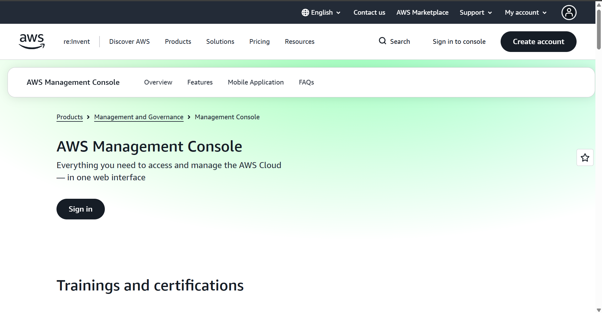

# AWS Research

## Brief Overview

Amazon Web Services (AWS) is a cloud computing platform operated by Amazon. AWS provides on-demand computing, storage, networking, databases, security, analytics, artificial intelligence, and many other cloud services.

AWS launched in 2006 and has become one of the largest public cloud platforms in the world. It supports organizations ranging from startups and small businesses to large enterprises and government agencies.

## Global Infrastructure

AWS operates a worldwide infrastructure consisting of Regions and Availability Zones. An AWS Region is a separate geographic area, while Availability Zones are isolated locations within a Region.

AWS currently has 39 launched Regions and 123 Availability Zones. AWS also provides Local Zones and Wavelength Zones for workloads that require lower latency.

The global infrastructure allows organizations to deploy applications closer to their customers and improve availability and disaster recovery.

## Cloud Management Console

The AWS Management Console is a web-based interface used to access and manage AWS services. Administrators can use the console to create resources, configure services, monitor applications, manage users, and review billing information.

The AWS console provides access to hundreds of AWS services through a centralized web interface.

## Four Core Services

### 1. Amazon EC2

Amazon Elastic Compute Cloud (EC2) provides virtual servers in the AWS cloud. Organizations can use EC2 to host websites, applications, databases, and other workloads.

### 2. Amazon S3

Amazon Simple Storage Service (S3) provides scalable object storage. It can be used for documents, images, backups, videos, application data, and data archives.

### 3. Amazon VPC

Amazon Virtual Private Cloud (VPC) allows organizations to create logically isolated networks in AWS. Administrators can configure subnets, routing, security groups, and network connectivity.

### 4. AWS IAM

AWS Identity and Access Management (IAM) controls access to AWS resources. It allows administrators to create users, roles, and permissions.

## Three Advantages

1. AWS provides a very broad selection of cloud services.
2. AWS has extensive global infrastructure for deploying applications around the world.
3. AWS provides flexible scalability and supports organizations ranging from startups to large enterprises.

## Typical Enterprise Use Cases

AWS is commonly used for:

- Web and mobile application hosting
- Data storage and backup
- Enterprise application migration
- Disaster recovery
- Big data analytics
- Artificial intelligence and machine learning
- E-commerce applications
- Serverless applications

## Screenshot Evidence

*Figure 1. AWS official website or management console.*
