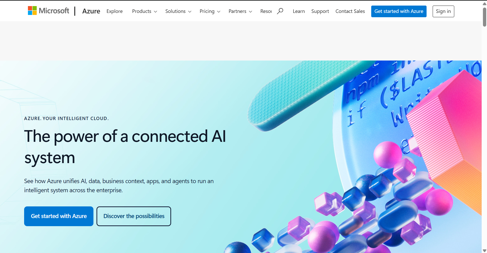

# Microsoft Azure Research

## Brief Overview

Microsoft Azure is Microsoft's public cloud computing platform. Azure provides infrastructure, databases, networking, storage, artificial intelligence, security, analytics, developer tools, and application services.

Azure is widely used by organizations that already depend on Microsoft technologies such as Windows Server, Microsoft 365, Active Directory, and other Microsoft enterprise products.

Azure was officially released in 2010.

## Global Infrastructure

Microsoft Azure operates a global infrastructure consisting of geographies, regions, datacenters, and availability zones.

Azure currently provides more than 70 regions globally. Azure regions are organized into geographic areas that can support data residency and compliance requirements.

Many Azure regions provide Availability Zones. Availability Zones are separated datacenter groups with independent power, cooling, and networking infrastructure.

## Cloud Management Console

The Azure management interface is called the Azure portal. It is a web-based interface that allows administrators and developers to create, configure, monitor, and manage Azure resources.

Users can manage virtual machines, storage accounts, databases, networking, security, identities, and other services through the portal.

## Four Core Services

### 1. Azure Virtual Machines

Azure Virtual Machines provide scalable virtual servers running Windows or Linux operating systems.

### 2. Azure Blob Storage

Azure Blob Storage provides scalable object storage for unstructured data such as documents, images, videos, backups, and application files.

### 3. Azure Virtual Network

Azure Virtual Network allows organizations to create private networks in Azure and connect cloud resources securely.

### 4. Microsoft Entra ID

Microsoft Entra ID is Microsoft's cloud identity and access management service. It can be used to manage users, groups, applications, authentication, and access policies.

## Three Advantages

1. Azure provides strong integration with Microsoft products and technologies.
2. Azure provides extensive hybrid-cloud capabilities.
3. Azure provides global infrastructure and many enterprise-focused services.

## Typical Enterprise Use Cases

Azure is commonly used for:

- Windows Server migration
- Microsoft 365 integration
- Hybrid cloud environments
- Enterprise application hosting
- Database hosting
- Virtual desktop infrastructure
- Artificial intelligence
- Data analytics
- Disaster recovery

## Screenshot Evidence

*Figure 1. Microsoft Azure official website or Azure portal.*
