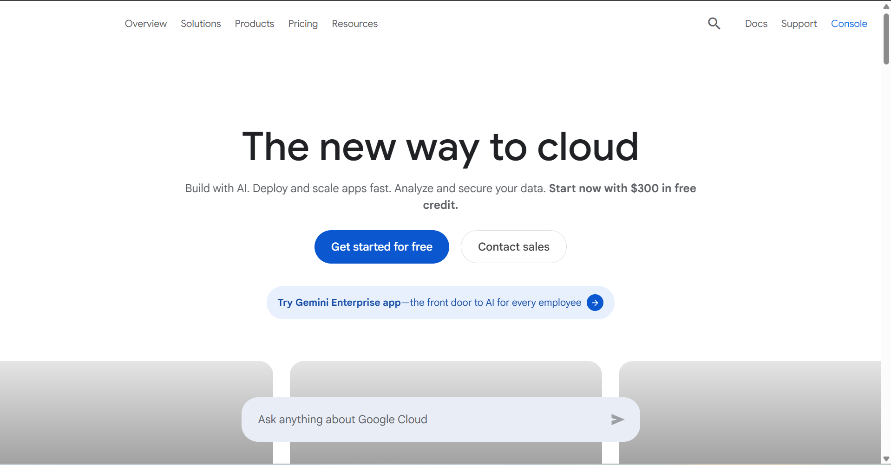

# Google Cloud Platform Research

## Brief Overview

Google Cloud Platform (GCP), commonly called Google Cloud, is Google's public cloud computing platform. It provides computing, storage, databases, networking, analytics, artificial intelligence, machine learning, Kubernetes, and developer services.

Google Cloud is particularly strong in data analytics, artificial intelligence, machine learning, and containerized application development.

Google Cloud was launched in 2008.

## Global Infrastructure

Google Cloud organizes its infrastructure into regions and zones. A region is a geographic area containing multiple zones.

Google Cloud currently provides 43 regions and 130 zones across the world.

Google also operates a large global network that connects its cloud infrastructure and helps provide low-latency connectivity.

## Cloud Management Console

The Google Cloud Console is a web-based management interface for Google Cloud resources.

Administrators and developers can use the console to manage virtual machines, databases, networks, storage, Kubernetes clusters, IAM permissions, APIs, monitoring, and other services.

## Four Core Services

### 1. Compute Engine

Compute Engine provides configurable virtual machines running on Google's infrastructure.

### 2. Cloud Storage

Cloud Storage provides scalable object storage for files, backups, application data, media, and other unstructured data.

### 3. Google Kubernetes Engine

Google Kubernetes Engine (GKE) is Google's managed Kubernetes service. It allows organizations to deploy and manage containerized applications.

### 4. Cloud SQL

Cloud SQL is a managed relational database service supporting database engines such as MySQL, PostgreSQL, and SQL Server.

## Three Advantages

1. Google Cloud has strong artificial intelligence and machine learning capabilities.
2. Google Cloud provides excellent Kubernetes and container support through GKE.
3. Google operates a large global network designed for high performance and low latency.

## Typical Enterprise Use Cases

Google Cloud is commonly used for:

- Artificial intelligence and machine learning
- Big data analytics
- Kubernetes and container applications
- Web application hosting
- Data warehousing
- Application modernization
- Global applications
- Software development

## Screenshot Evidence

*Figure 1. Google Cloud official website or management console.*
